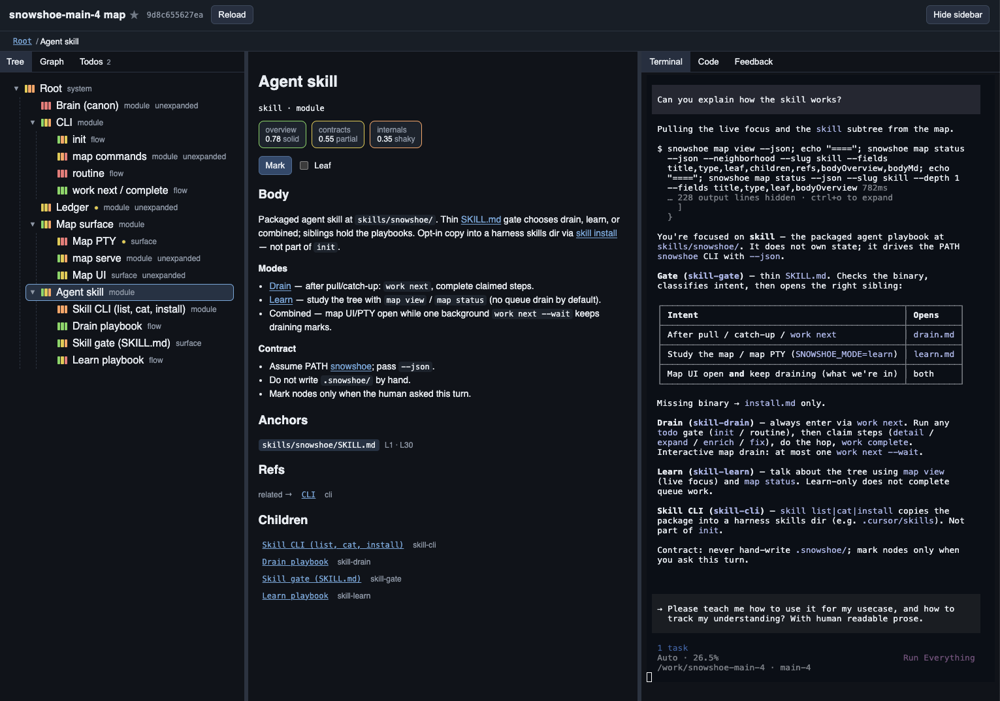

# Snowshoe

[](LICENSE)
[](https://github.com/igorkravcenko/snowshoe/actions/workflows/ci.yml)

**Don't let your agents outrun your understanding. Keep your footing.**

Catch up after pull. That is the gist of what this project helps with.
Snowshoe shows what in your personal understanding went stale after changes.
You choose what to catch up on. Agents can help.

Your map lives in `.snowshoe/` and stays gitignored by default. Local, git-native,
Apache-2.0. Not a team wiki. Not an agent control panel.



## Install

Use Bun 1.1+. npm may work, but it is untested. The PATH binary is **`snowshoe`** (alias **`snoe`** is the same entrypoint).

> [!IMPORTANT]
> This project is `@igorkravcenko/snowshoe` on npm. Bare `snowshoe` without the scope is an unrelated package.

Optional: `bun add -g snoe` / `npm i -g snoe` is a thin alias for the same CLI (`snoe` on PATH).

### 1. Put `snowshoe` on PATH

**From the registry** (scoped package only):

```bash
bun add -g @igorkravcenko/snowshoe
# or: npm install -g @igorkravcenko/snowshoe
command -v snowshoe
```

**From a clone of this project** (contributors / local link):

```bash
bun install --frozen-lockfile
bun link
# ensure ~/.bun/bin is on PATH
command -v snowshoe
```

### 2. Clone the repo you want to understand

Snowshoe maps **your** working tree. Clone (or open) that repository.
Keep it separate from your day-to-day checkout so learning stays apart from other work.

```bash
git clone <your-repo> && cd <your-repo>
```

### 3. Install the skill into the agent harness

Example for Cursor:

```bash
snowshoe skill install --json --skills-path .cursor/skills
```

Other harnesses: pass their skills directory as `--skills-path`.

## Learning

1. **Open the UI**:

   ```bash
   snowshoe map serve --open
   ```

   Default port is **3232** (override with `--port`; `0` = ephemeral).

2. **Start an agent in the map UI terminal** and invoke the Snowshoe skill in **combined** mode:

   ```
   /snowshoe combined
   ```

   Optionally specify the language you want in the prompt.
   Combined mode lets the agent be both a worker (building and expanding the mental map)
   and a tutor (talking with you and teaching).
   Do **not** start more than one worker at a time.

3. **Traverse** the mental map with the tree or the graph views. **Mark** the nodes of interest for expansion and enrichment.
   The worker agent should pick up the work you asked for and update the map accordingly.
   For now, reload the map manually with the `Reload` button.
   If you want something specific, just ask the agent.

4. **Learn** by asking your agent to explain things and teach you. **Track** your understanding with the matching metrics.

5. **Pull** changes for the repo. Trigger the Snowshoe skill to react to the changes.

## What it is / is not

| v1 intent | Not (v1) |
|---|---|
| After a pull: what went stale. You pick what to catch up. | A chat that “knows the repo” |
| Personal comprehension map | Multiplayer knowledge graph |
| Human-chosen catch-up | Agent HITL / control plane |

Positioning: [docs/product/positioning.md](docs/product/positioning.md).

If you're interested in a collaborative version of this for teams - let me know.

## Docs

Agents and contributors: start at [AGENTS.md](AGENTS.md).
License: [Apache 2.0](LICENSE) ([NOTICE](NOTICE)).
Contributing: [CONTRIBUTING.md](CONTRIBUTING.md). Security: [SECURITY.md](SECURITY.md).
